# Hilltop Tea - System Flowcharts

## 1. Authentication Flow

### 1.1 Login Process

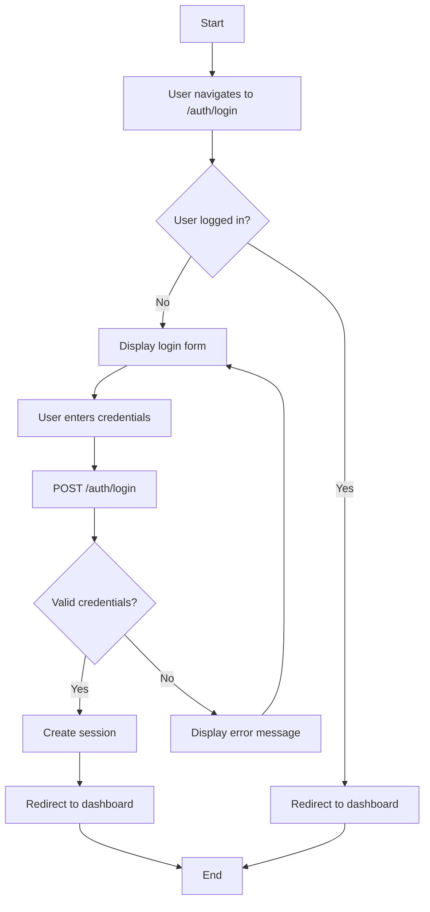

### 1.2 Logout Process

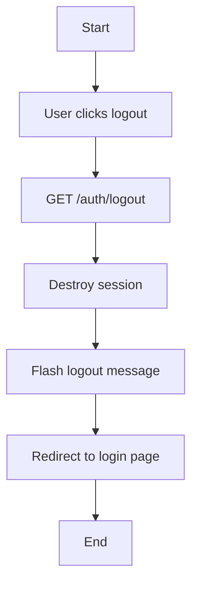

### 1.3 Password Change Process

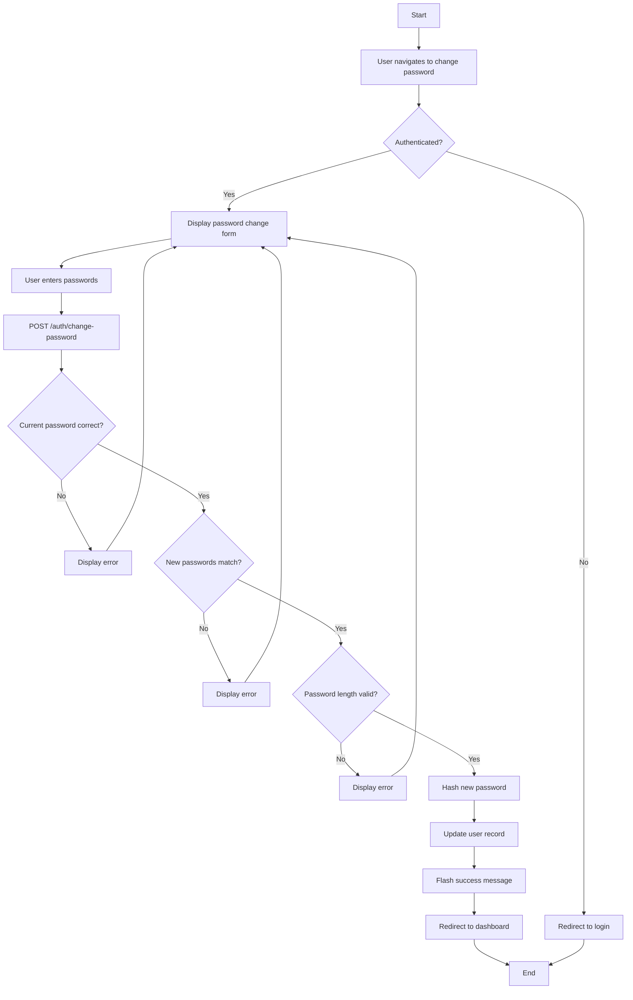

## 2. Production Entry Flow

### 2.1 Daily Production Entry

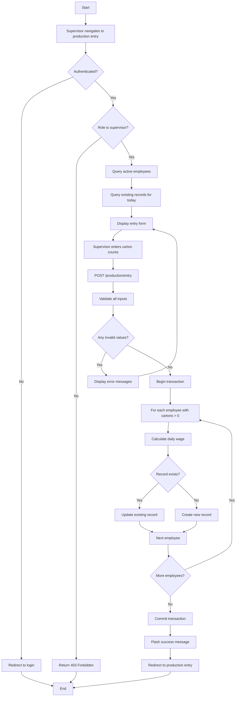

### 2.2 Wage Calculation Process

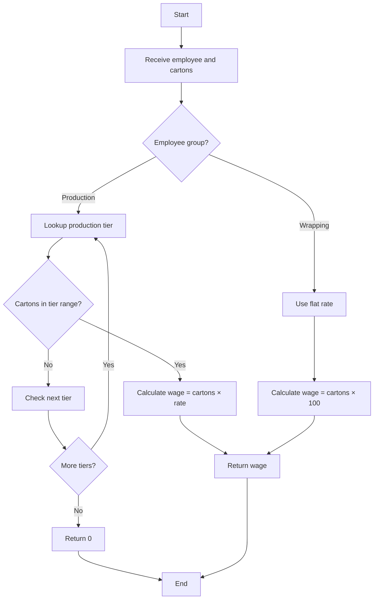

## 3. Payroll Flow

### 3.1 Monthly Payroll View

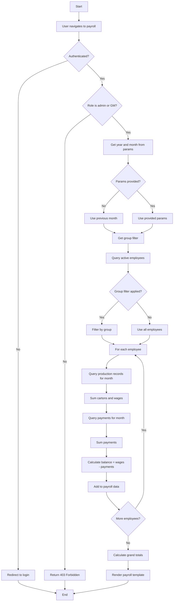

### 3.2 Payment Recording

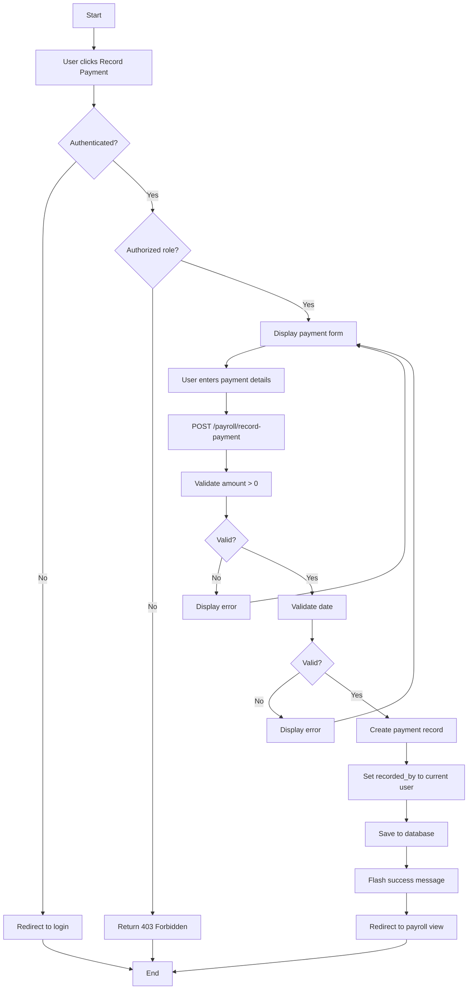

### 3.3 Balance Calculation

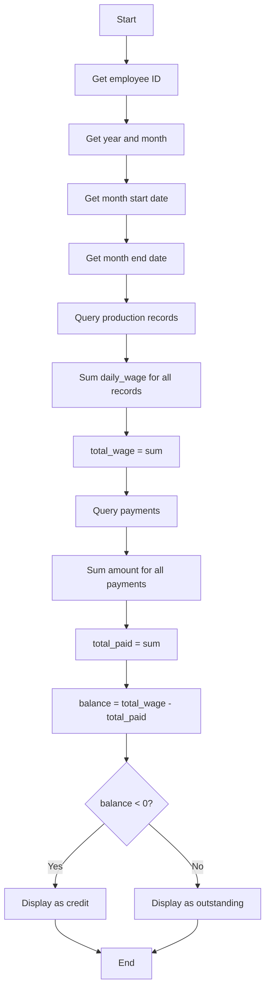

## 4. Employee Management Flow

### 4.1 Create Employee

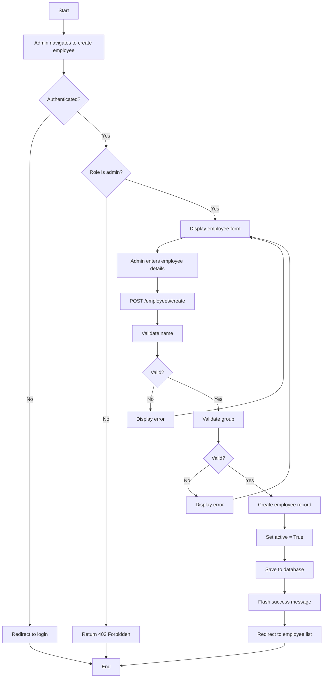

### 4.2 Delete Employee (Soft Delete)

```mermaid
flowchart TD
    A[Start] --> B[Admin clicks delete employee]
    B --> C{Authenticated?}
    C -->|No| D[Redirect to login]
    C -->|Yes| E{Role is admin?}
    E -->|No| F[Return 403 Forbidden]
    E -->|Yes| G[Display confirmation dialog]
    G --> H{User confirms?}
    H -->|No| I[Return to employee list]
    H -->|Yes| J[POST /employees/{id}/delete]
    J --> K[Query employee]
    K --> L{Employee exists?}
    L -->|No| M[Return 404]
    L -->|Yes| N[Set active = False]
    N --> O[Save to database]
    O --> P[Flash warning message]
    P --> Q[Redirect to employee list]
    Q --> R[End]
    D --> R
    F --> R
    I --> R
    M --> R
```

## 5. PDF Generation Flow

### 5.1 Wage Sheet PDF Generation

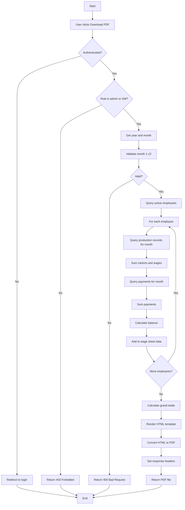

## 6. Error Handling Flow

### 6.1 General Error Handling

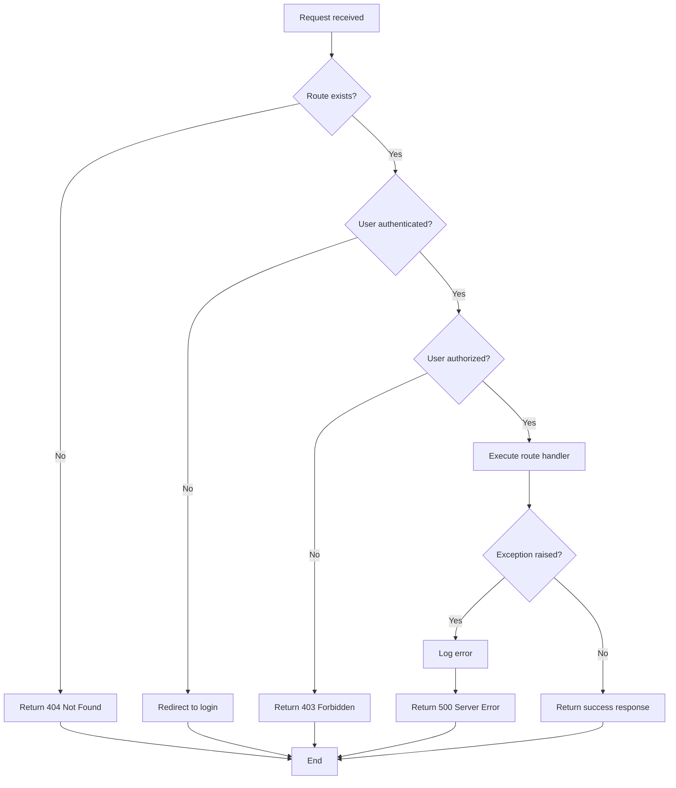

### 6.2 Validation Error Flow

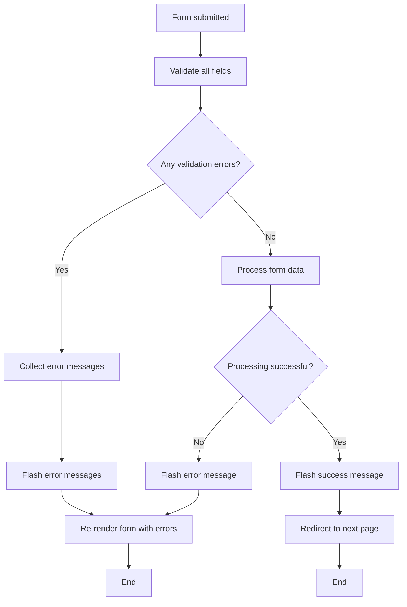

## 7. Data Flow Diagrams

### 7.1 Production Data Flow

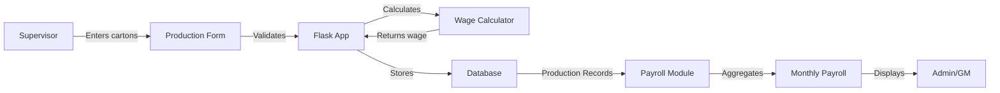

### 7.2 Payment Data Flow

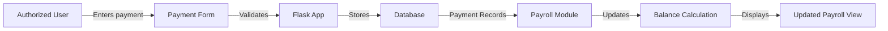

## 8. System Startup Flow

### 8.1 Application Initialization

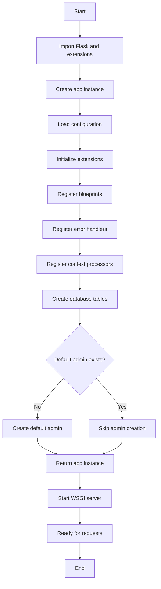

## 9. User Session Flow

### 9.1 Session Lifecycle

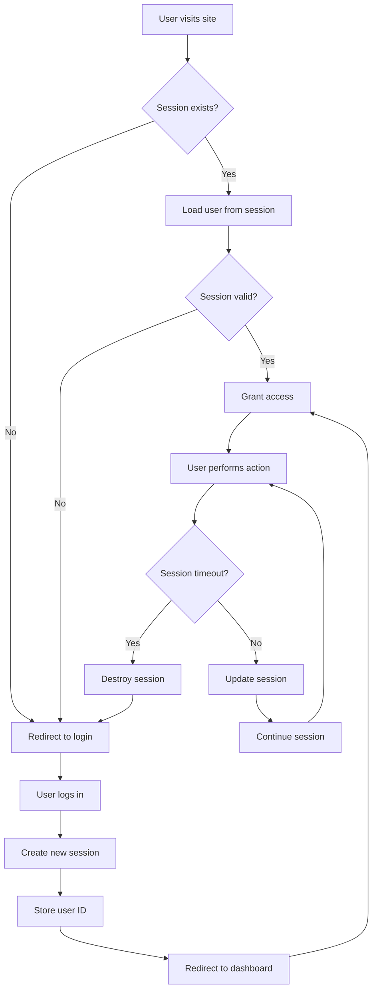

## 10. Month Navigation Flow

### 10.1 Payroll Month Navigation

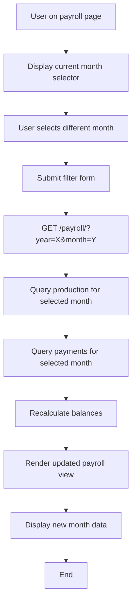
