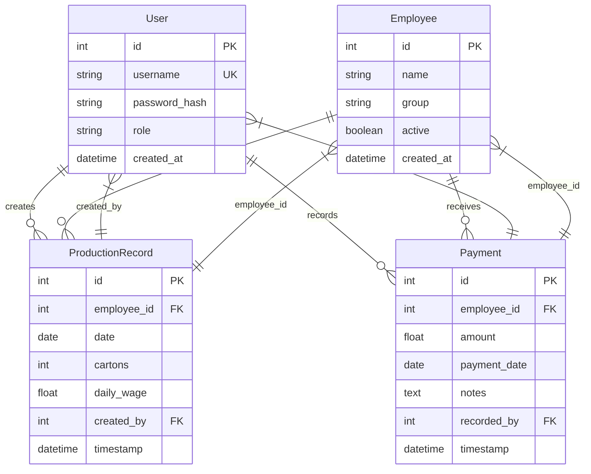
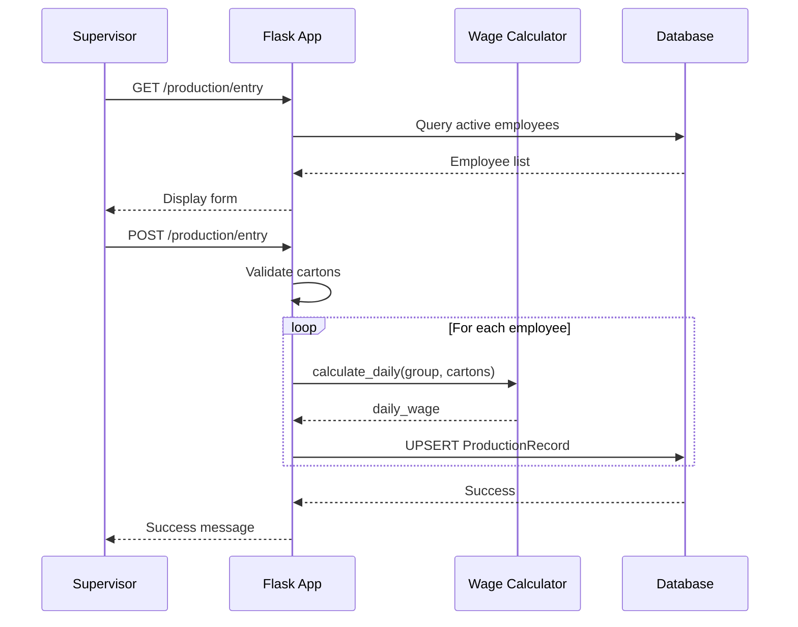
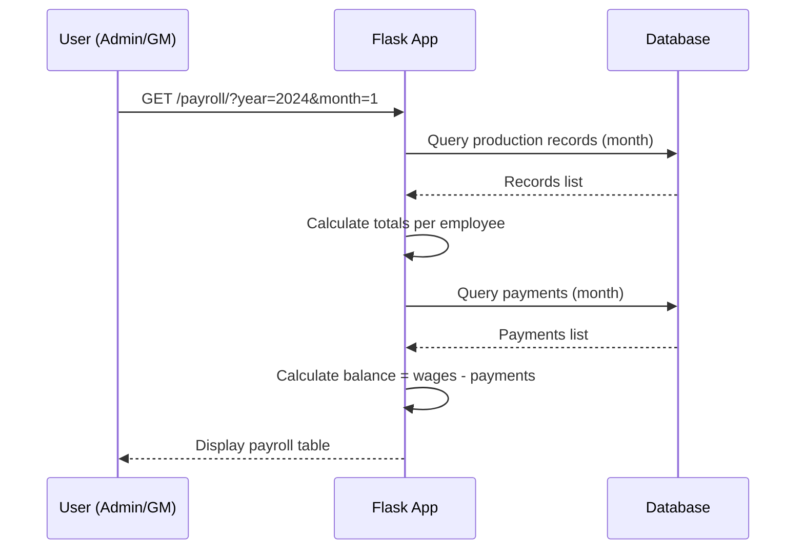
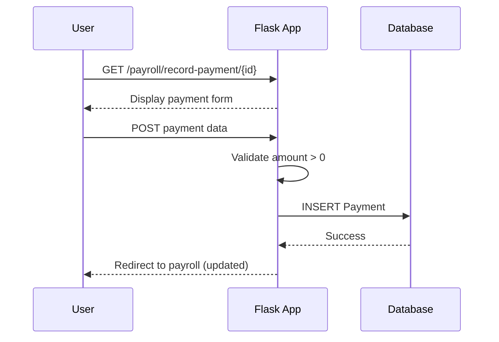
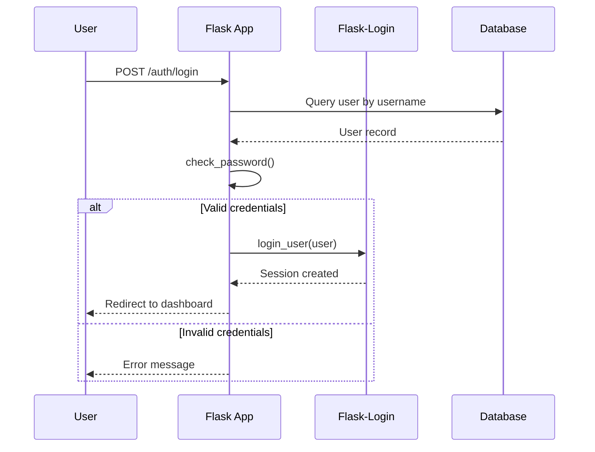
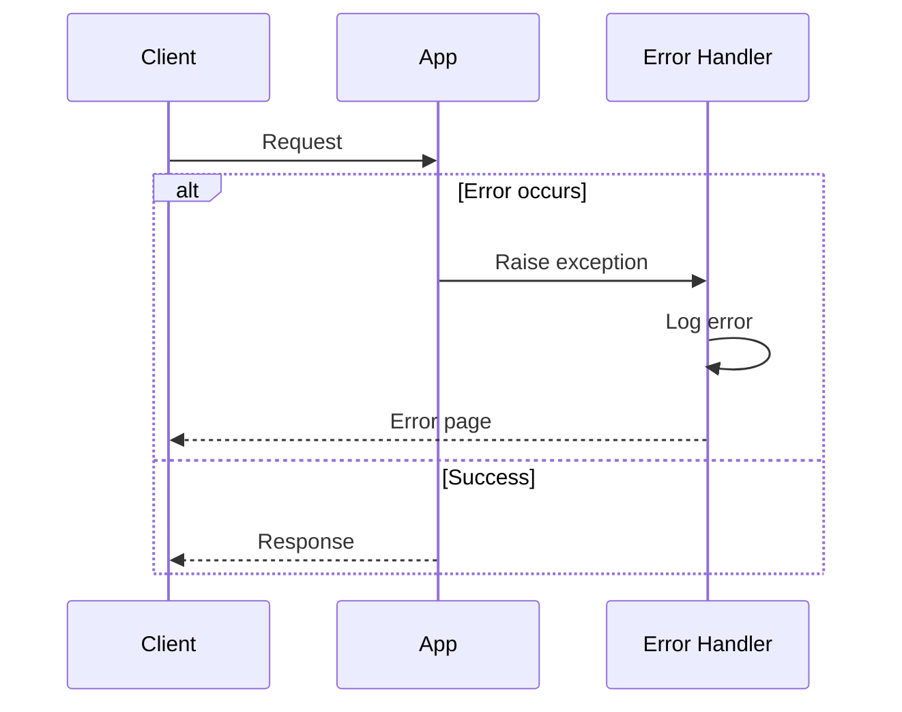

# Hilltop Tea - System Architecture

## 1. Overview

The Hilltop Tea Management System is a web-based application built using the Flask framework following the Model-View-Controller (MVC) architectural pattern. The system is designed for scalability, maintainability, and security.

## 2. Architectural Pattern

### 2.1 MVC Pattern

```
┌─────────────────────────────────────────────────────────────┐
│                         VIEW LAYER                          │
│  ┌──────────────┐  ┌──────────────┐  ┌──────────────┐      │
│  │   Templates  │  │   Static     │  │   Forms      │      │
│  │  (Jinja2)    │  │   Files      │  │  (WTForms)   │      │
│  └──────────────┘  └──────────────┘  └──────────────┘      │
└─────────────────────────────────────────────────────────────┘
                              │
                              ▼
┌─────────────────────────────────────────────────────────────┐
│                      CONTROLLER LAYER                        │
│  ┌──────────────┐  ┌──────────────┐  ┌──────────────┐      │
│  │   Auth BP    │  │  Employees   │  │  Production  │      │
│  │              │  │     BP       │  │     BP       │      │
│  └──────────────┘  └──────────────┘  └──────────────┘      │
│  ┌──────────────┐  ┌──────────────┐                        │
│  │   Payroll    │  │   Reports    │                        │
│  │     BP       │  │     BP       │                        │
│  └──────────────┘  └──────────────┘                        │
└─────────────────────────────────────────────────────────────┘
                              │
                              ▼
┌─────────────────────────────────────────────────────────────┐
│                        MODEL LAYER                           │
│  ┌──────────────┐  ┌──────────────┐  ┌──────────────┐      │
│  │    User      │  │  Employee    │  │ Production   │      │
│  │   Model      │  │   Model      │  │   Record     │      │
│  └──────────────┘  └──────────────┘  └──────────────┘      │
│  ┌──────────────┐                                            │
│  │   Payment    │                                            │
│  │   Model      │                                            │
│  └──────────────┘                                            │
└─────────────────────────────────────────────────────────────┘
                              │
                              ▼
┌─────────────────────────────────────────────────────────────┐
│                      DATA LAYER                               │
│  ┌──────────────┐  ┌──────────────┐  ┌──────────────┐      │
│  │  SQLAlchemy  │  │   Database   │  │   Wage       │      │
│  │    ORM       │  │   (SQLite/   │  │  Calculator  │      │
│  │              │  │  PostgreSQL)  │  │     ADT      │      │
│  └──────────────┘  └──────────────┘  └──────────────┘      │
└─────────────────────────────────────────────────────────────┘
```

## 3. Component Architecture

### 3.1 Application Factory Pattern

The application uses the factory pattern for creating Flask app instances:

```python
def create_app(config_name=None):
    app = Flask(__name__)
    # Configuration
    # Extensions initialization
    # Blueprint registration
    # Error handlers
    # Context processors
    return app
```

**Benefits:**
- Easy testing with multiple app instances
- Flexible configuration
- Clean separation of concerns

### 3.2 Blueprint Organization

The application is organized into modular blueprints:

| Blueprint | Prefix | Purpose |
|-----------|--------|---------|
| auth | /auth | Authentication and authorization |
| employees | /employees | Employee management |
| production | /production | Production entry and history |
| payroll | /payroll | Payroll view and payment recording |
| reports | /reports | PDF generation and reports |

## 4. Database Schema

### 4.1 Entity Relationship Diagram



### 4.2 Table Descriptions

#### Users Table
Stores authentication and authorization data.

**Indexes:**
- PRIMARY KEY: id
- UNIQUE: username

**Constraints:**
- password_hash NOT NULL
- role NOT NULL

#### Employees Table
Stores employee information.

**Indexes:**
- PRIMARY KEY: id
- INDEX: name
- INDEX: active

**Constraints:**
- name NOT NULL
- group NOT NULL
- active NOT NULL

#### Production Records Table
Stores daily production data.

**Indexes:**
- PRIMARY KEY: id
- INDEX: date
- UNIQUE: (employee_id, date)

**Constraints:**
- employee_id NOT NULL
- date NOT NULL
- cartons NOT NULL
- daily_wage NOT NULL
- created_by NOT NULL

#### Payments Table
Stores payment records.

**Indexes:**
- PRIMARY KEY: id
- INDEX: payment_date

**Constraints:**
- employee_id NOT NULL
- amount NOT NULL
- payment_date NOT NULL
- recorded_by NOT NULL

## 5. Data Flow

### 5.1 Production Entry Flow



### 5.2 Payroll Calculation Flow



### 5.3 Payment Recording Flow



## 6. Security Architecture

### 6.1 Authentication Flow



### 6.2 Authorization Layers

1. **Authentication Layer**
   - Flask-Login session management
   - @login_required decorator

2. **Role-Based Access Control**
   - Custom @role_required decorator
   - User model permission methods

3. **Route Protection**
   - Blueprint-level checks
   - View function checks

### 6.3 Security Measures

| Measure | Implementation |
|---------|----------------|
| Password Hashing | Werkzeug security (bcrypt) |
| Session Management | Flask-Login with secure cookies |
| CSRF Protection | Flask-WTF |
| SQL Injection Prevention | SQLAlchemy ORM |
| XSS Prevention | Jinja2 auto-escaping |

## 7. Wage Calculation Architecture

### 7.1 ADT Design

The Wage Calculator follows Abstract Data Type principles:

```python
class WageCalculator:
    """ADT for computing daily wages."""

    def calculate_daily(self, employee_group, cartons):
        """Public interface - returns wage."""
        # Implementation hidden

    def _production_wage(self, cartons):
        """Private method - production calculation."""

    def _wrapping_wage(self, cartons):
        """Private method - wrapping calculation."""
```

### 7.2 Table-Driven Logic

```python
PRODUCTION_TIERS = [
    (0, 349, 250),
    (350, 399, 270),
    (400, 499, 300),
    (500, float('inf'), 320)
]
```

**Benefits:**
- No if-else chains
- Easy to modify rates
- Clear business rules
- Testable

## 8. Frontend Architecture

### 8.1 Template Hierarchy

```
base.html (layout)
├── login.html (standalone)
├── index.html (dashboard)
├── employee_list.html
├── employee_form.html
├── production_entry.html
├── production_history.html
├── payroll.html
├── record_payment.html
├── wage_sheet_pdf.html
└── errors/
    ├── 403.html
    ├── 404.html
    └── 500.html
```

### 8.2 Static Assets

```
static/
├── css/
│   └── style.css (premium theme)
├── js/
│   └── (empty - inline scripts used)
└── lib/
    ├── bootstrap.min.css
    └── bootstrap.bundle.min.js
```

### 8.3 CSS Architecture

The CSS uses CSS custom properties (variables) for theming:

```css
:root {
    --color-tea-green: #1e3932;
    --color-gold: #c9a96e;
    --color-cream: #f5f2eb;
    /* ... */
}
```

## 9. API Design

### 9.1 RESTful Endpoints

| Method | Endpoint | Purpose | Auth |
|--------|----------|---------|------|
| GET | / | Redirect to dashboard | Optional |
| GET | /auth/login | Login form | Public |
| POST | /auth/login | Process login | Public |
| GET | /auth/logout | Logout | Required |
| GET | /production/dashboard | Dashboard | Required |
| GET | /production/entry | Production form | Supervisor |
| POST | /production/entry | Save production | Supervisor |
| GET | /payroll/ | Payroll view | Admin/GM |
| POST | /payroll/record-payment/{id} | Record payment | Admin/GM/Supervisor |
| GET | /reports/wage-sheet/{year}/{month} | PDF download | Admin/GM |

### 9.2 API Response Format

**Success Response:**
```json
{
    "status": "success",
    "data": { ... }
}
```

**Error Response:**
```json
{
    "status": "error",
    "message": "Error description"
}
```

## 10. Deployment Architecture

### 10.1 Development Environment

```
┌─────────────────────────────────────┐
│         Development Server           │
│  ┌──────────────┐                   │
│  │  Flask Dev   │                   │
│  │   Server     │                   │
│  └──────────────┘                   │
│         │                           │
│  ┌──────▼──────┐                    │
│  │  SQLite DB  │                    │
│  └─────────────┘                    │
└─────────────────────────────────────┘
```

### 10.2 Production Environment

```
┌─────────────────────────────────────┐
│      Production Server              │
│  ┌──────────────┐                   │
│  │   Waitress   │                   │
│  │  WSGI Server │                   │
│  └──────────────┘                   │
│         │                           │
│  ┌──────▼──────┐                    │
│  │ PostgreSQL  │                    │
│  │   Database   │                    │
│  └─────────────┘                    │
└─────────────────────────────────────┘
```

## 11. Scalability Considerations

### 11.1 Database Optimization

- Indexed columns for frequent queries
- Unique constraints for data integrity
- Connection pooling (production)

### 11.2 Caching Strategy

- Session-based caching for user data
- Template caching for production
- Static file caching via browser headers

### 11.3 Future Scaling

1. **Horizontal Scaling**
   - Load balancer
   - Multiple application servers
   - Shared session storage (Redis)

2. **Database Scaling**
   - Read replicas
   - Database sharding
   - Connection pooling

3. **Microservices**
   - Separate auth service
   - Separate payroll service
   - API gateway

## 12. Technology Stack

### 12.1 Backend

| Component | Technology | Version |
|-----------|-----------|---------|
| Framework | Flask | 3.0.0 |
| ORM | SQLAlchemy | 3.1.1 |
| Auth | Flask-Login | 0.6.3 |
| Forms | WTForms | 3.1.1 |
| PDF | WeasyPrint | 60.1 |

### 12.2 Frontend

| Component | Technology | Version |
|-----------|-----------|---------|
| Framework | Bootstrap | 5.x |
| Templates | Jinja2 | Latest |
| Icons | Font Awesome | 6.4.0 |
| Fonts | Google Fonts | Latest |

### 12.3 Development

| Component | Technology | Version |
|-----------|-----------|---------|
| Language | Python | 3.8+ |
| Testing | pytest | 7.4.3 |
| Coverage | pytest-cov | 4.1.0 |
| Server | Waitress | 3.0.0 |

## 13. Code Organization

### 13.1 Directory Structure

```
hilltop_tea/
├── app/
│   ├── __init__.py          # App factory
│   ├── models.py            # Database models
│   ├── forms.py             # Form classes
│   ├── auth.py              # Auth blueprint
│   ├── employees.py         # Employee blueprint
│   ├── production.py        # Production blueprint
│   ├── payroll.py           # Payroll blueprint
│   ├── reports.py           # Reports blueprint
│   ├── wage_calculator.py   # Wage ADT
│   ├── utils.py             # Utilities
│   ├── static/              # Static files
│   └── templates/           # Templates
├── docs/                    # Documentation
├── tests/                   # Test suite
├── instance/                # Database
├── config.py                # Configuration
├── requirements.txt          # Dependencies
└── run.py                   # Entry point
```

### 13.2 Naming Conventions

- **Modules**: snake_case
- **Classes**: PascalCase
- **Functions**: snake_case
- **Constants**: UPPER_CASE
- **Private members**: _prefix

## 14. Error Handling

### 14.1 Error Types

| Error Type | HTTP Status | Handling |
|------------|-------------|----------|
| Not Found | 404 | Custom 404 page |
| Forbidden | 403 | Custom 403 page |
| Server Error | 500 | Custom 500 page |
| Validation Error | 400 | Form errors |
| Authentication Error | 401 | Redirect to login |

### 14.2 Error Response Flow


